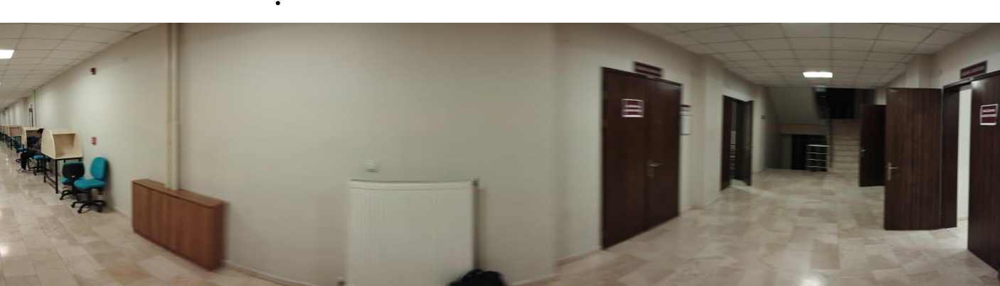
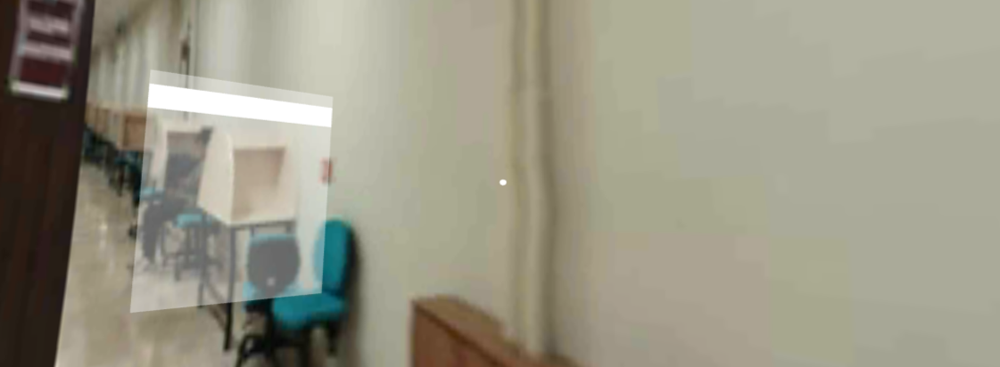
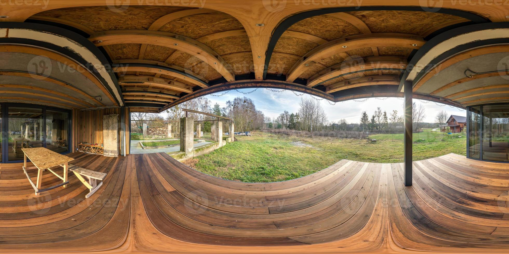
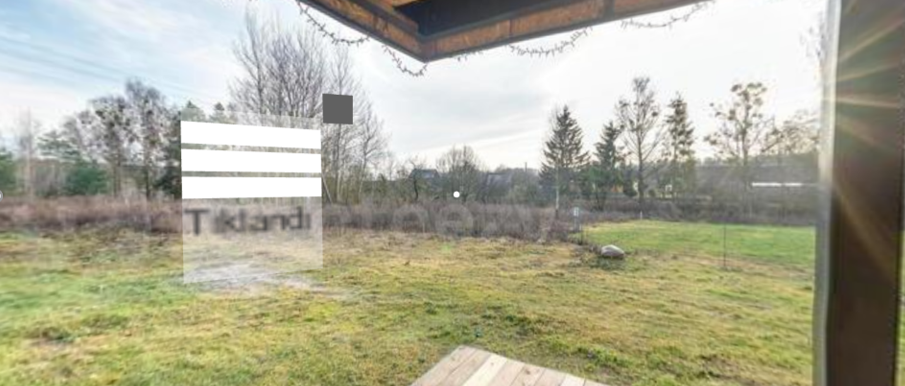
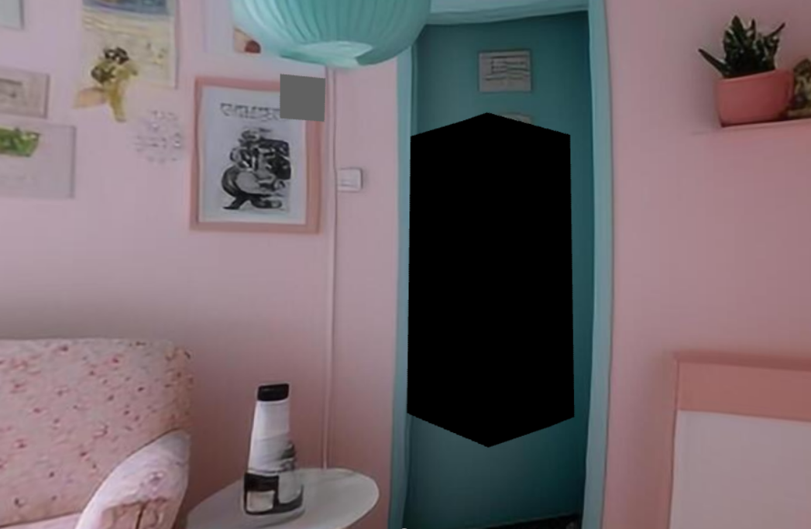
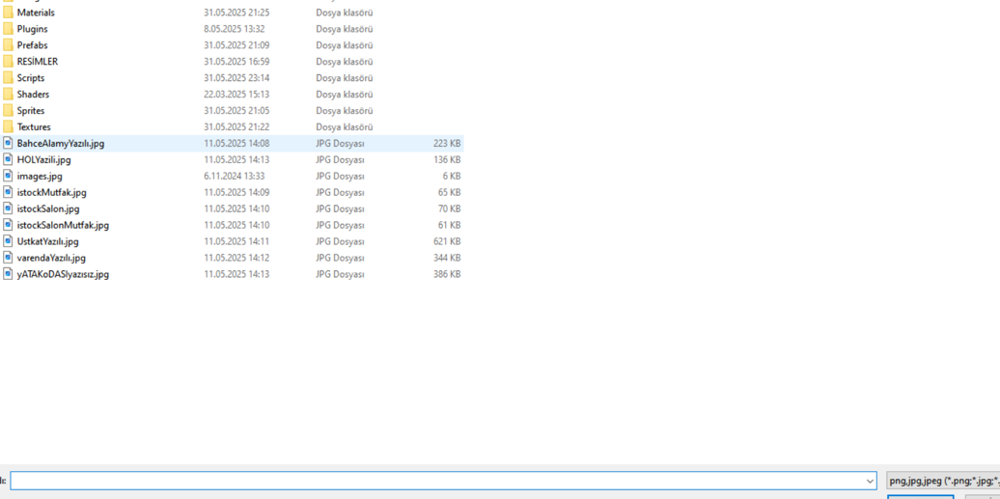

VIRTUAL APARTMENT

In this project, a new method has been developed that allows users to upload panoramic photographs as if they were apartment images. Users can freely explore the uploaded panoramic photos, navigate inside them, and view the apartments in 3D.

## Features

- Users can transform their own panoramic 360-degree photos into a virtual reality environment.
- Photos added to this environment can have different fields of view (not just full 360 degrees).
- By placing a “door” object, users can transition between different environments as they wish.

## Screenshots

 